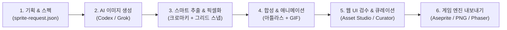

# 🎨 sprite-studio

**생성형 AI로 상용 퀄리티의 2D 게임 스프라이트와 애니메이션 아틀라스를 제작하는 올인원 스튜디오 파이프라인**

AI는 원본 이미지(Raw) 생성과 선택적 생성형 프레임 보간에만 활용하고, 이후의 핵심 과정(배경 투명화, 프레임 분리, 픽셀 그리드 정렬, 팔레트 양자화, 아틀라스 패킹, 엔진 메타데이터 내보내기)은 **결정론적(Deterministic) 알고리즘**이 처리합니다. 특히 후처리는 같은 입력과 설정에 대해 같은 결과가 나오도록 설계되어 있습니다.

- **라이선스**: Apache-2.0 (전문은 [`LICENSE`](LICENSE))
- **버전**: 1.59.0 (`pyproject.toml`과 `SKILL.md`의 `version:`과 동기화됨)

> **이 저장소는 [`sprite-gen`](https://github.com/aldegad/sprite-gen)을 포크해 Asset Studio로 새로 고도화한 프로젝트입니다.**

---

## 🌟 왜 sprite-studio인가요?

일반 생성형 AI로 게임 스프라이트를 만들 때 겪는 문제들을 완벽하게 해결합니다:

| 일반 AI 이미지 생성의 한계 | sprite-studio의 해결 방식 |
|---|---|
| ❌ 배경 누끼(투명화) 시 가장자리 깨짐 및 잔여 색상 발생 | ✅ **스마트 크로마키 & CbCr 분리**: Hermite 소프트 매트와 디스필(Despill)로 완벽한 투명 알파 추출 |
| ❌ 프레임마다 캐릭터 크기, 중심축, 위치가 제각각 튐 | ✅ **알파 중심축(Alpha-Centroid) 자동 정렬 & 슬라이싱**: 프레임 간 흔들림 없는 일관된 애니메이션 보장 |
| ❌ 도트 스타일이지만 실제로는 안티에일리어싱 뭉개짐(가짜 도트) | ✅ **결정론적 픽셀 언페이크(Pixel-Unfake) & 격자 스냅**: 진짜 픽셀 아트 격자(Pitch/Phase)로 자동 스냅 |
| ❌ 색상 변형(Colorway)을 위해 AI를 다시 돌리면 형태가 변함 | ✅ **원클릭 팔레트 스왑(Recolor)**: 기본 시트 1개로 N가지 색상 변형 시트를 수학적으로 즉시 굽기(Bake) |
| ❌ 게임 엔진(Unity, Godot, Phaser 등)에 넣기 번거로움 | ✅ **표준 포맷 원클릭 익스포트**: Aseprite JSON, 프레임별 PNG, GIF, 스프라이트 아틀라스 시트 자동 생성 |

---

## 🔄 전체 제작 파이프라인 흐름



> 필요할 때만 Codex/Grok 기반 생성형 프레임 보간을 추가할 수 있습니다. 보간 결과도
> 최종 에셋으로 사용하기 전에 동일한 결정론적 추출·정제 단계를 거칩니다.

---

## 🚀 빠른 시작 (Quick Start)

### 1. 설치 및 환경 설정

> [!IMPORTANT]
> **CPython 3.10+** 및 표준 라이브러리의 `venv`/`ensurepip`가 필요합니다.
> 격리된 환경과 정확한 의존성(Pillow, NumPy) 관리를 위해 반드시 가상환경(`.venv`)을 생성하여 사용하세요.

**macOS / Linux:**
```bash
python3 -m venv .venv
source .venv/bin/activate
pip install -e ".[studio,api,dev]"
```

**Windows (PowerShell):**
```powershell
py -m venv .venv
.\.venv\Scripts\Activate.ps1
pip install -e ".[studio,api,dev]"
```

---

### 2. 사용 방식 선택: GUI, API, CLI

`sprite-studio`는 **시각적 웹 스튜디오(GUI)**, **FastAPI API**, **터미널 자동화 파이프라인(CLI)**을 지원합니다.

#### 🖥️ 방법 A: Asset Studio (Gradio 웹 GUI)

초보자나 아티스트는 마우스 클릭만으로 프롬프트 생성, 이미지 추출, 정제, QA를 수행할 수 있습니다:

```bash
python -m studio.app
```
브라우저에서 `http://127.0.0.1:7860`으로 접속하여 작업합니다.

* **🎭 Sprite Mode**: 캐릭터의 여러 방향 이동, 공격, 대기 등 연속 프레임 애니메이션 제작
* **🏞️ Static Mode**: 타일셋, 배경, 정지 아이콘, 오브젝트 컷아웃 및 심리스(Seamless) 이음새 검사

---

#### 🌐 방법 B: FastAPI API (React 마이그레이션용)

현재 API 셸은 상태 확인, 이미지 업로드, 런 생성·조회·삭제, 프롬프트 조회·수정, 생성·정규화·추출·정제, 배치 실행 및 진행률 스트림을 제공합니다. 또한 Review/Repair, Anchor, Animation QA, Curation launch, Sprite Export, Preset, Static Mode 라우트가 연결되어 있습니다. [`studio/api/ENDPOINTS.md`](studio/api/ENDPOINTS.md)에 구현 현황이 표시되어 있습니다.

```bash
python -m studio.api.main              # 사용 가능한 포트를 자동 선택
python -m studio.api.main --port 8765  # 포트를 고정하고 싶을 때
```

실행 시 출력되는 주소의 `/docs`에서 OpenAPI 문서를 확인합니다. 개발 중에는 `--reload`를 추가할 수 있습니다.

---

#### ⚛️ 방법 C: React/Vite 웹 UI (현재 마이그레이션 단계)

React 화면은 FastAPI를 통해서만 기존 Studio Service와 Engine에 접근합니다. 개발 모드에서는 두 프로세스를 실행하며, Vite가 `/api`와 WebSocket 요청을 FastAPI `8765` 포트로 프록시합니다.

터미널 1 — API:

```bash
python -m studio.api.main --port 8765
```

터미널 2 — React:

```bash
cd web
npm install
npm run dev
```

브라우저에서 `http://127.0.0.1:5173`으로 접속합니다. 현재 React UI에는 Project, Static, Generate, Refine, Repair, QA, Curation/Export, Batch 흐름이 연결되어 있습니다. 상세 실행법은 [`web/README.md`](web/README.md)를 참고하세요.

API가 다른 주소에서 실행 중이면 `web/.env.local`에 `VITE_API_BASE_URL`을 지정할 수 있습니다.

빌드 후에는 별도 Vite 포트 없이 FastAPI 하나로 실행할 수 있습니다:

```bash
cd web
npm run build
cd ..
python -m studio.api.main --port 8765
```

`web/dist`가 존재하면 FastAPI가 React 정적 파일을 함께 서빙하므로 `http://127.0.0.1:8765`으로 접속합니다. Tauri 패키징은 이 웹 배포 흐름이 안정화된 뒤 별도 검토합니다.

---

#### 💻 방법 D: CLI 파이프라인 (명령어로 빠른 일괄 처리)

```bash
# 1. 런(Run) 프로젝트 생성 (스펙, 프롬프트, 레이아웃 가이드 생성)
sprite-studio prepare --out-dir runs/hero --character-id hero --base-image base.png

# 2. AI 상태별 행(Row) 생성 (Codex 또는 Grok 연동)
sprite-studio gen --provider grok \
  --prompt-file runs/hero/prompts/attack.txt \
  --out runs/hero/raw/attack.png \
  --ref runs/hero/base-source.png \
  --ref runs/hero/references/layout-guides/attack.png

# 3. Grok이 넓은 캔버스를 반환한 경우 행을 셀 규격으로 정규화한 뒤 추출
sprite-studio extract --run-dir runs/hero --normalize-grok-row

# 4. 스프라이트 시트 아틀라스 및 런타임 매니페스트 합성
sprite-studio compose-atlas --run-dir runs/hero

# 5. 애니메이션 미리보기 & 웹 큐레이션 뷰 실행
sprite-studio preview --run-dir runs/hero
sprite-studio curation --run-dir runs/hero
```

---

## 💡 주요 기능 상세

### 1. 🎭 Sprite Mode vs 🏞️ Static Mode
`Asset Studio`는 만드는 에셋의 특성에 따라 최적화된 두 가지 전용 모드를 제공합니다:

| 구분 | Sprite Mode (스프라이트 모드) | Static Mode (스태틱 모드) |
|---|---|---|
| **대상 에셋** | 캐릭터/몬스터/유닛 애니메이션 프레임 행 | 배경 타일, 맵 오브젝트, 아이콘, 단일 일러스트 |
| **셀 피치(격자)** | 모든 애니메이션 상태에 걸쳐 **고정 잠금** | 이미지별 개별 최적 크기 자동 계산 |
| **위상(Phase) 보정** | 프레임 간 흔들림 방지를 위해 제한적 범위 내 보정 | 자유로운 2차원 위상 최적화 |
| **디더링(Dithering)** | 픽셀 뭉침 방지를 위해 **절대 사용 안 함** | 질감 표현을 위해 선택적 사용 가능 |
| **특화 기능** | 질량 중심축(Centroid) 정렬, 호흡(Breathe) 애니메이션 | 심리스(Seamless) 이음새 검사, 씬 컷아웃 |

---

### 2. 🎨 컬러웨이 (원클릭 팔레트 스왑)
캐릭터의 2P 컬러, 속성별 변형(불/물/번개), 적 몬스터 색놀이(Elite/Boss) 버전을 클릭 한 번으로 제작합니다:

```bash
# 1. 베이스 시트에서 사용된 색상 팔레트 맵 추출
sprite-studio recolor-palette --base runs/hero/sprite-sheet-alpha.png --out palette.json

# 2. 지정한 팔레트 스펙대로 다양한 컬러웨이 시트 즉시 굽기(Bake)
sprite-studio recolor --run-dir runs/hero --spec recolor-spec.json
```

---

### 3. 🔍 비주얼 큐레이션 웹뷰 (Side-by-Side Compare)
에이전트나 CLI 환경에서 확인하기 힘든 이미지 후보들을 웹 브라우저에서 나란히 띄워놓고 최적의 픽을 고릅니다:

```bash
# 임의의 이미지 폴더(후보군)를 불러와서 브라우저 큐레이션 뷰 띄우기
sprite-studio unpack-atlas --pngs-dir ./candidates --out-dir runs/pick
sprite-studio curation --run-dir runs/pick
```

---

### 4. 📦 게임 엔진 포맷 내보내기 (Export)
완성된 결과물을 엔진에서 사용할 수 있는 파일과 메타데이터로 변환합니다:

* **Aseprite 호환 JSON**: 완성된 아틀라스의 프레임·태그·재생 시간을 기록하는 JSON 메타데이터를 생성합니다 (`sprite-studio export-aseprite`). `.aseprite` 원본 파일 자체를 만들지는 않습니다.
* **개별 PNG 프레임 분리**: 상태 및 방향별 프레임 PNG 내보내기 (`sprite-studio export-pngs`)
* **애니메이션 GIF**: 기획 검토 및 웹 공유용 GIF 생성 (`sprite-studio compose-gif`)

---

## 🛠️ CLI 도구 전체 요약

| 분류 | 명령어 | 설명 |
|---|---|---|
| **런 관리** | `prepare` | 신규 프로젝트 런 생성 및 가이드/프롬프트 빌드 |
| | `migrate-request` / `migrate-kinds` / `migrate-breathe` | 요청 스펙 및 온디스크 데이터 마이그레이션 |
| **생성** | `gen` | AI 이미지 생성기(Codex/Grok) 호출 |
| | `normalize-grok-row` | 생성된 행 이미지 규격 표준화 |
| **추출/정제** | `extract` | 크로마키 제거, 픽셀 그리드 스냅, 프레임 분리 |
| | `cutout` | 단색 배경 이미지에서 투명한 오브젝트 컷아웃 생성 |
| | `slice-sheet` | 기존 시트에서 개별 셀 분리 슬라이싱 |
| | `unpack-atlas` | 기존 아틀라스를 프레임 단위로 언팩 |
| **방향/합성** | `anchor` | 큐레이션 결과에서 방향 앵커를 해석·베이크 |
| **합성** | `compose-atlas` | 전체 프레임을 단일 아틀라스 시트로 패킹 |
| | `compose-cycle` / `compose-gif` | 특정 동작 애니메이션 GIF 렌더링 |
| | `compose-layers` | 다중 레이어 합성 |
| | `compose` | 폴더의 이미지 후보를 행에 배치하는 웹 합성 캔버스 |
| **내보내기** | `export-aseprite` | Aseprite 호환 JSON 포맷 익스포트 |
| | `export-pngs` | 상태별 개별 PNG 프레임 파일 내보내기 |
| **컬러/큐레이션**| `recolor` / `recolor-palette` | 팔레트 추출 및 컬러웨이 시트 굽기 |
| | `curation` | 웹 브라우저 기반 시각적 비교/선택 뷰어 |
| **QA/품질** | `preview` | 애니메이션 재생 검수 |
| | `inspect` / `score` / `correction-loop` | 자동 품질 채점 및 자가 교정 루프 |

---

## 📚 상세 기술 문서

더 자세한 아키텍처 및 알고리즘 설명은 `docs/` 디렉터리의 문서를 참조하세요:

* **핵심 구조 및 계약**: [`docs/architecture.md`](docs/architecture.md) · [`docs/run-contract.md`](docs/run-contract.md)
* **모드별 알고리즘**: [`docs/asset-studio-modes.md`](docs/asset-studio-modes.md) · [`docs/studio.md`](docs/studio.md)
* **크로마키 & 픽셀화**: [`docs/chroma-alpha.md`](docs/chroma-alpha.md) · [`docs/pixel-unfake.md`](docs/pixel-unfake.md)
* **팔레트 & 레이어**: [`docs/recolor.md`](docs/recolor.md) · [`docs/layer-tracks.md`](docs/layer-tracks.md)
* **엔진 연동**: [`docs/engine-export.md`](docs/engine-export.md)
* **Asset Studio 사용법**: [`docs/studio.md`](docs/studio.md) · API 엔드포인트 계약: [`studio/api/ENDPOINTS.md`](studio/api/ENDPOINTS.md)
* **문제 해결 (FAQ)**: [`docs/troubleshooting.md`](docs/troubleshooting.md)

---

## 🧪 테스트 실행

```bash
pip install -e ".[studio,api,dev]"
pytest                      # 전체 테스트 실행
pytest tests/frames         # 특정 도메인 테스트만 실행
```

---

## 📄 라이선스 (License)

이 프로젝트는 **Apache License 2.0**에 따라 배포됩니다. 전문은 [`LICENSE`](LICENSE) 파일에서 확인하실 수 있습니다.

* 본 저장소는 Apache-2.0 라이선스로 배포되는 [`sprite-gen`](https://github.com/aldegad/sprite-gen)의 포크에서 출발하였으며 동일한 라이선스(Apache-2.0)를 유지합니다.
* **제3자 귀속 고지 ([`NOTICE`](NOTICE))**: `perfectpixel-studio`(MIT, Andrew Kim)에서 이식한 알고리즘 코드 4건(알파 중심축 정렬, 투영 프로파일 분할, YCbCr 크로마키, 런렝스 피치 추정)에 대한 저작권 및 라이선스 고지는 `NOTICE` 파일에 보존되어 있습니다.
* 보안 문제 신고 절차는 [`SECURITY.md`](SECURITY.md)를 참조하세요.
